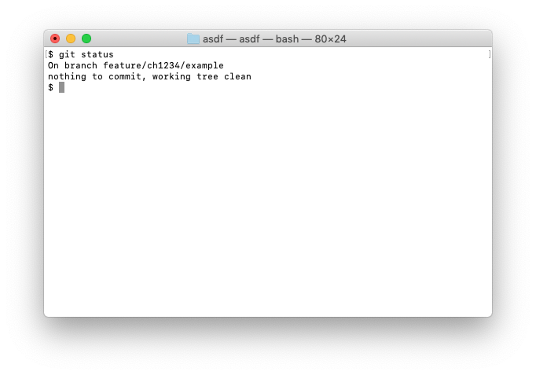

# annotate-git-commit

`annotate-git-commit` adds ticket identifier parsed from branch name to Git commit messages.



If you include ticket identifier in a regularly parseable format in your ticket names, you can add a call to `annotate-git-commit` in your `prepare-commit-msg` git hook and it will add the parsed ticket identifier to your commit messages.

Here's an example of a `.git/hooks/prepare-commit-msg` script that parses [ClubHouse] identifiers:

```sh
annotate-git-commit add-ticket '\b(ch\d+)\b' "$1"
```

When you type `git commit` in the repository and your branch name is `feature/ch1234/foo`, the commit message will end in the line `Ticket: ch1234`.

## Installation

`annotate-git-commit` is built in [Swift] 4.2. It has been tested on a Mac (running macOS 10.14.1), but it should work fine on Linux too.

To install it, clone the repository and in the repository root run:

```sh
swift build -c release -Xswiftc -static-stdlib
cp ./.build/x86_64-apple-macosx10.10/release/annotate-git-commit /usr/local/bin
```

### mint

You can also install it with [mint]:

```sh
mint install juri/annotate-git-commit
```

## Error handling

`annotate-git-commit` will exit with a status code in case of an IO error or failed regular expression parsing. You can choose how it behaves in case of failed ticket name parsing (i.e. invalid branch name or failed git execution.)

The default is to omit the ticket information from the commit but to exit successfully so as to not cause problems just because you didn't have a ticket id in your branch name. You can specify other behaviors:

- Adding the flag `--abort` will make it abort on error with an error message and error status.
- `--placeholder PLACEHOLDER` will use PLACEHOLDER instead of the ticket id in the commit message.

[ClubHouse]: https://clubhouse.io
[Swift]: https://swift.org
[mint]: https://github.com/yonaskolb/mint
